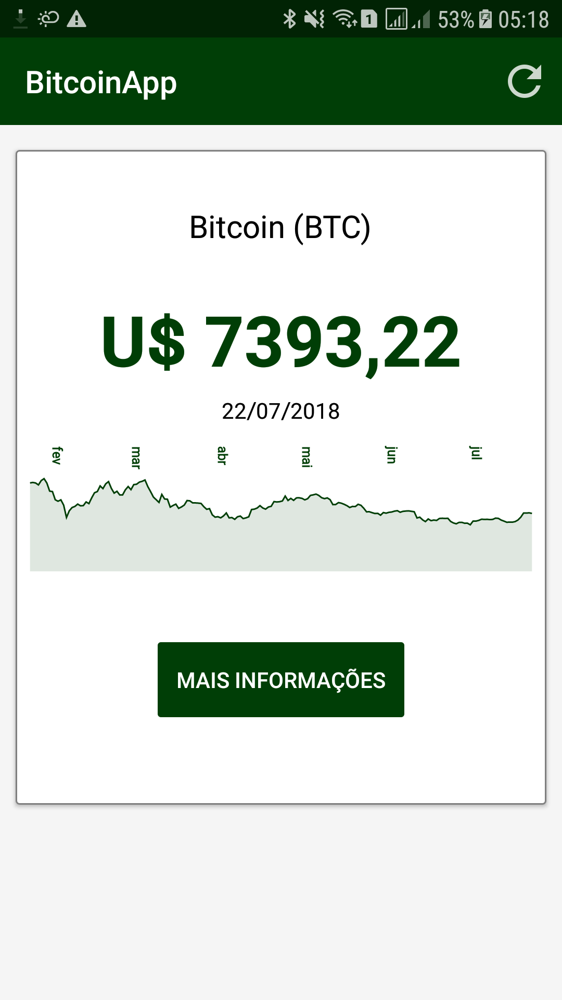
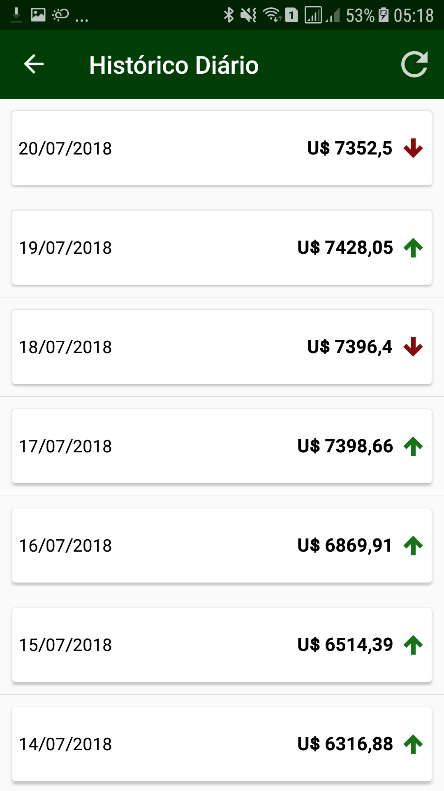

# Bitcoin App

Aplicativo desenvolvido em __Xamarin.Forms__.

Bibliotecas utilizadas:
* [Microcharts](https://github.com/aloisdeniel/Microcharts)
* [Newonsoft](https://github.com/JamesNK/Newtonsoft.Json)
* [SQLite-net](https://github.com/praeclarum/sqlite-net)
* [Unity](https://github.com/unitycontainer/unity)
* [Conectify Plugin](https://github.com/jamesmontemagno/ConnectivityPlugin)
* [Xamarin Forms Labs](https://github.com/XLabs/Xamarin-Forms-Labs)

## O que há de novo

* O App voltou a funcionar. \o/
* Internacionalização: os textos e datas do App estão em Inglês e Português, e acordo com o idioma do dispositivo.
* Agora o App tem um ícone bonitão :heart:
* Foi implementada uma listagem das cotações diárias do Bitcoin, informando inclusive se o valor subiu ou caiu, de acordo com o dia anterior.

## Screenshots

### Problemas conhecidos

1. ~~Por algum problema com a injeção de dependência na classe __App.xaml.cs__ o app parou de funcionar na sua última versão =(. [Vide branch dev2]~~ Alguns itens ainda precisam ser melhorados:
   1. ~~Faltou uma listagem com os valores das cotações diárias, que seria chamada ao clicar no botão "Mais opções da MainPage"~~
   1. ~~Internacionalização, faltou a criação dos AppResources para formatar as datas e exibir as mensagens em outros idiomas~~
   1. Alguns métodos e propriedades ficaram 'sobrando' no projeto. Não tive tempo de dar um refinamento.
   1. ~~O ícone do App é o default do Xamarin~~
   1. Não tem nenhum teste unitário =(
   
Updated Test Plans and Procedures   
  
Adicionar gerência de uma instituição financeira: Caixa preta e integração

Criação da área de login: Teste de interface e integração
Este teste poderá ser feito de forma exploratória, já que será apenas uma interface a ser testada. 

Adicionar quadro de acompanhamento de tarefas: Teste unitário e de interface

Validação de e-mail: Caixa preta
Teste executado sem acesso ao código, passando diferentes formatos de email para a validação.

Correção de relação entre personagem e usuário: Caixa preta
Teste relacionado com o banco de dados, onde foi validado a relação dos personagens com o usuário que os criou. 

Criação de área de cadastro de usuários: Teste unitário e de interface

Melhoria geral na interface: Teste de interface
Teste realizado de forma exploratória. 

Adicionar o sistema de carteira online: Caixa preta e integração

Mensagem de sucesso: Caixa preta e interface
Teste feito se a mensagem foi executada de forma correta.

